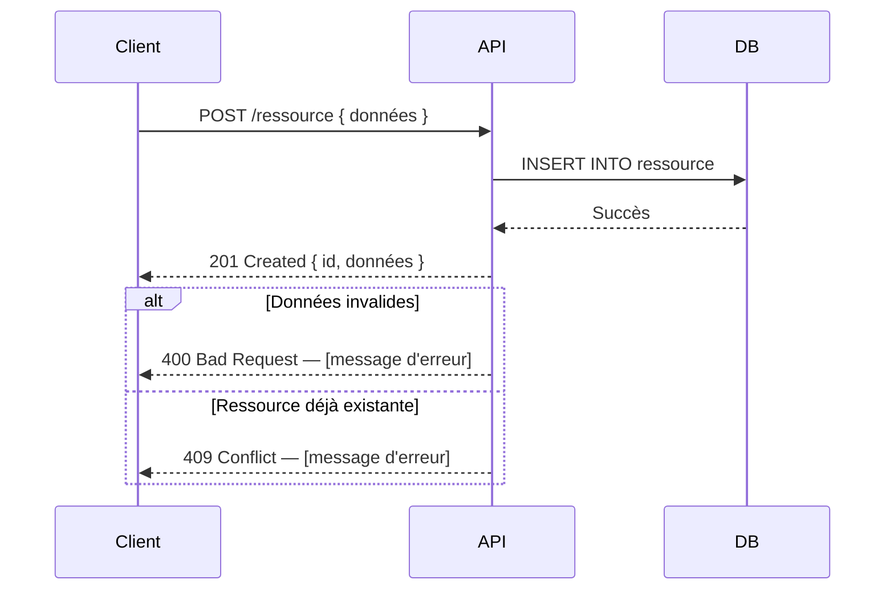

# Références — DDD, Architecture et gabarits

> Fiches techniques à consulter ponctuellement pendant les phases de conception.
> Ce fichier n'est pas lu de haut en bas — il est consulté à la demande.

---

## Concepts DDD — glossaire

Le **Domain-Driven Design (DDD)** structure le code autour du métier, pas autour de la base de données.

| Concept            | Définition                                                                          | Critère clé                                                    |
| ------------------ | ----------------------------------------------------------------------------------- | -------------------------------------------------------------- |
| **Aggregate Root** | Objet central du domaine — point d'entrée, accessible par son propre `Id`           | On peut l'utiliser indépendamment de tout autre objet          |
| **Entité enfant**  | Objet qui n'existe pas sans son parent — accessible uniquement via lui              | Si le parent est supprimé, l'enfant n'a plus de sens           |
| **Value Object**   | Groupe de valeurs sans identité propre — immuable, remplacé entièrement             | Pas de `Id`, plusieurs attributs qui n'ont de sens qu'ensemble |
| **Enum**           | Liste fixe de valeurs connues à la compilation                                      | Les valeurs ne changent jamais à l'exécution                   |
| **Domain Service** | Règle métier qui implique plusieurs agrégats — ne peut pas vivre dans un seul objet | Nécessite de lire ou modifier plus d'un agrégat                |
| **Invariant**      | Règle qui doit toujours être vraie sur un objet — validée dans le constructeur      | Si la règle est violée, l'objet est dans un état incohérent    |

**Arbre de décision pour qualifier un concept :**

```
Le métier en parle directement ?
├── Non → c'est une propriété d'un autre objet (attribut)
└── Oui → Peut-il exister seul ?
           ├── Non → Entité enfant (appartient à un parent)
           └── Oui → A-t-il une identité propre (Id) ?
                      ├── Non → Value Object (groupe de valeurs)
                      └── Oui → Aggregate Root
```

---

## Architecture 4 couches

```
┌─────────────────────────────────┐
│           API                   │  ← Controllers, middleware, Swagger
│  (expose les fonctionnalités)   │     Dépend de Application
├─────────────────────────────────┤
│        Infrastructure           │  ← Repositories EF Core, jobs, cache, services externes
│  (accès aux données externes)   │     Dépend de Application
├─────────────────────────────────┤
│         Application             │  ← Services métier, DTOs, interfaces repositories
│  (orchestre les use cases)      │     Dépend de Domain uniquement
├─────────────────────────────────┤
│           Domain                │  ← Entités, Value Objects, enums, invariants
│  (le cœur — zéro dépendance)    │     Ne dépend de RIEN
└─────────────────────────────────┘
```

**Règle fondamentale :** chaque couche ne connaît que les couches en dessous d'elle. Le Domain ne sait pas qu'EF Core existe. L'Application ne sait pas qu'il y a des controllers.

**Pourquoi coder dans cet ordre (Domain → Application → Infrastructure → API) :**
Coder le Domain en premier force à exprimer les règles métier sans penser à la base de données. Si on commence par l'Infrastructure, la BD dicte le modèle — c'est l'approche BD-Centric qu'on cherche à éviter.

---

## Test-Driven Development (TDD)

Le **TDD** est la méthode de développement requise pour tous les projets utilisant ce playbook. Le code est toujours précédé d'un test qui échoue.

### Cycle Red → Green → Refactor

```
1. Red    — écrire un test décrivant le comportement attendu → le test échoue
2. Green  — écrire le minimum de code pour faire passer le test
3. Refactor — nettoyer le code (le test reste vert)
```

Ne jamais écrire du code de production sans test qui précède. Ne jamais sauter l'étape Refactor.

### Application par couche (dans l'ordre DDD)

| Ordre | Couche         | Ce qu'on teste                                                 | Outils                          |
| ----- | -------------- | -------------------------------------------------------------- | ------------------------------- |
| 1     | Domain         | Invariants, constructeurs, Value Objects, règles métier pures  | xUnit                           |
| 2     | Application    | Use cases, orchestration, cas d'erreur                         | xUnit + Moq (mock repositories) |
| 3     | Infrastructure | Persistance, requêtes EF Core, migrations                      | xUnit + Testcontainers          |
| 4     | API            | Contrats HTTP, codes de retour, format des réponses JSON       | WebApplicationFactory           |

Coder dans cet ordre garantit que les règles métier sont testées indépendamment de la base de données, et que les bugs d'infrastructure ne masquent pas les bugs domaine.

### Convention de nommage des tests

```
[Méthode_ou_Comportement]_[Contexte]_[Résultat_attendu]

Exemples :
CreateDiet_WhenNoWeightEntry_Throws422
MacroDistribution_WhenSumIsNot100_ThrowsDomainException
LaunchDiet_WhenDietAlreadyActive_Returns409
```

### Structure des projets de test

```
[Projet].Domain.Tests/          ← tests unitaires Domain (0 mock, 0 infrastructure)
[Projet].Application.Tests/     ← tests unitaires Application (Moq des repositories)
[Projet].Infrastructure.Tests/  ← tests d'intégration (Testcontainers — vraie DB)
[Projet].Api.Tests/             ← tests API end-to-end (WebApplicationFactory)
```

### Definition of Done — modèle à adapter par projet

La DoD se pose une fois au démarrage, s'applique à toutes les Stories sans être répétée dans chaque ticket.

```
Une Story est terminée quand :
- [ ] Le code compile sans erreur ni warning
- [ ] Le test a été écrit avant le code de production (TDD — Red → Green → Refactor)
- [ ] Tous les tests de la Story passent
- [ ] Aucun test existant n'est cassé (zéro régression)
- [ ] Les invariants métier sont couverts par au moins un test
- [ ] Le code respecte l'architecture DDD (pas de logique métier hors Domain)
- [ ] La PR est relue et approuvée avant merge
```

À placer dans : `docs/backend/livrable/jira-backlog-decomposition.md` (en-tête du backlog).

---

### Ce qu'on ne teste PAS en TDD

- Le câblage DI (Program.cs) — testé implicitement par les tests API
- Les migrations EF Core — vérifiées par Testcontainers au runtime
- Les getters/setters sans logique — inutile, ratio effort/valeur nul

---

## CLAUDE.md — contenu type

Le fichier `CLAUDE.md` donne le contexte du projet à l'IA en début de chaque session. Sans lui, l'IA repart de zéro.

```markdown
# CLAUDE.md — [Nom du projet]

## Contexte du projet

[2-3 phrases : quel problème, pour qui, quel objectif d'apprentissage]

## Stack technique

| Composant       | Technologie           |
| --------------- | --------------------- |
| Backend         | [langage / framework] |
| Base de données | [BDD]                 |
| Auth            | [solution auth]       |
| Tests           | [framework de test]   |

## Méthode de collaboration

[Approche souhaitée : Socratique / directif / revue de code / autre]

## Modèle domaine — état actuel

[Résumé des Aggregate Roots, entités, Value Objects identifiés]

## Fichiers clés

| Fichier                      | Utilité                           |
| ---------------------------- | --------------------------------- |
| `SUIVI-PROJET.md`            | Source de vérité sur l'avancement |
| [autres fichiers importants] | [rôle]                            |

## Prochaine étape

[Une ligne : ce qu'on fait à la prochaine session]
```

---

## Format workflow Mermaid — exemple minimal

Les workflows se rédigent en `sequenceDiagram`. Chaque fichier couvre un flux complet (nominal + erreurs).



**Conventions :**

- `->>` flèche pleine = appel / requête
- `-->>` flèche pointillée = réponse
- `alt / else / end` = cas d'erreur ou branches conditionnelles
- `loop` = répétition (ex: traitement par batch)
- `Note over [participant]` = commentaire contextuel
